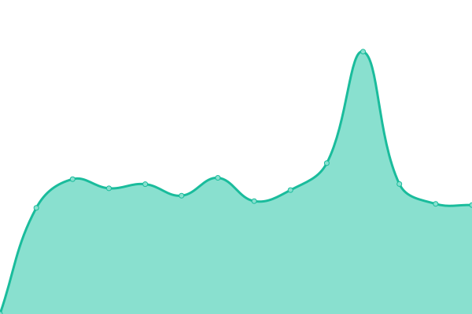
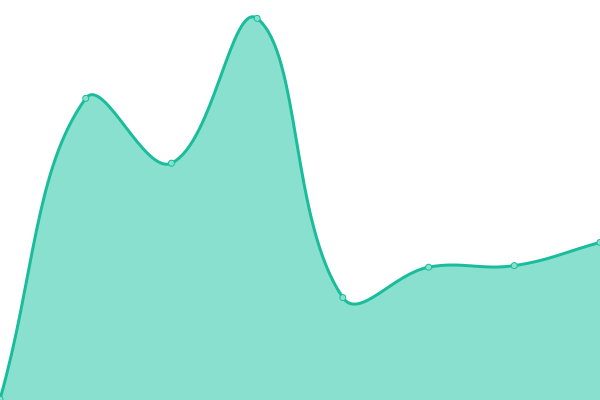
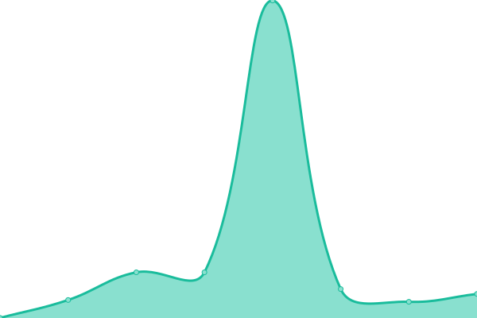

# [📈 Live Status](https://upptime.github.io/upptime): <!--live status--> **🟧 Partial outage**

This repository contains the open-source uptime monitor and status page for [Upptime](https://upptime.js.org), powered by [Upptime](https://github.com/upptime/upptime).

With [Upptime](https://upptime.js.org), you can get your own unlimited and free uptime monitor and status page, powered entirely by a GitHub repository. We use [Issues](https://github.com/upptime/upptime/issues) as incident reports, [Actions](https://github.com/ricardomaia/upptime/actions) as uptime monitors, and [Pages](https://upptime.github.io/upptime) for the status page.

<!--start: status pages-->
<!-- This summary is generated by Upptime (https://github.com/upptime/upptime) -->
<!-- Do not edit this manually, your changes will be overwritten -->
<!-- prettier-ignore -->
| URL | Status | History | Response Time | Uptime |
| --- | ------ | ------- | ------------- | ------ |
|  [XAONIX.com](https://xaonix.com/) | 🟩 Up | [xaonix-com.yml](https://github.com/XAONIX/status/commits/HEAD/history/xaonix-com.yml) | 

 1637ms
     
 | 

<a href="https://status.xaonix.com/history/xaonix-com">100.00%</a>
    

|  [GenLex](https://genlex.app/) | 🟩 Up | [gen-lex.yml](https://github.com/XAONIX/status/commits/HEAD/history/gen-lex.yml) | 

 163ms
     
 | 

<a href="https://status.xaonix.com/history/gen-lex">100.00%</a>
    

|  [SignAll](https://signall.app/) | 🟥 Down | [sign-all.yml](https://github.com/XAONIX/status/commits/HEAD/history/sign-all.yml) | 

 0ms
     
 | 

<a href="https://status.xaonix.com/history/sign-all">0.00%</a>
    

|  [LoftyTools](https://lofty.tools/) | 🟩 Up | [lofty-tools.yml](https://github.com/XAONIX/status/commits/HEAD/history/lofty-tools.yml) | 

 298ms
     
 | 

<a href="https://status.xaonix.com/history/lofty-tools">100.00%</a>
    

|  Spookfish Server | 🟩 Up | [spookfish-server.yml](https://github.com/XAONIX/status/commits/HEAD/history/spookfish-server.yml) | 

 293ms
     
 | 

<a href="https://status.xaonix.com/history/spookfish-server">100.00%</a>
    

<!--end: status pages-->

[**Visit our status website →**](https://upptime.github.io/upptime)

## 📄 License

- Powered by: [Upptime](https://github.com/upptime/upptime)
- Code: [MIT](./LICENSE) © [Upptime](https://upptime.js.org)
- Data in the `./history` directory: [Open Database License](https://opendatacommons.org/licenses/odbl/1-0/)
